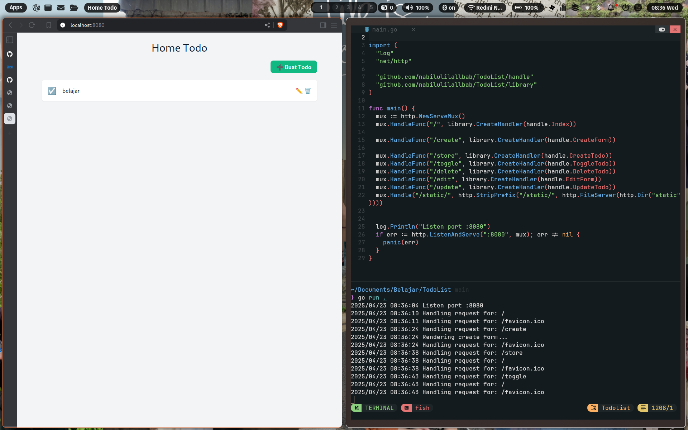

# TodoList (Golang Web App)

Aplikasi to-do list sederhana menggunakan **Golang**, **PostgreSQL**, dan **HTML template** (tanpa API atau framework frontend).

## Fitur

- Tambah to-do
- Edit to-do
- Hapus to-do
- Tandai selesai / belum selesai
- Tampilkan daftar tugas via HTML langsung

## Stack Teknologi

- Go (`net/http`)
- GORM (ORM untuk PostgreSQL)
- PostgreSQL
- HTML Template
- (Opsional) Tailwind CSS

## Tampilan Antarmuka

Berikut adalah beberapa screenshot dari tampilan aplikasi:

- **Halaman Utama**  
  

- **Tambah Tugas**  
  

- **Edit Tugas**  
  
  
  

## Struktur Folder

```txt
.
├── config/         # Konfigurasi database
├── entity/         # Struct entitas/model
├── handle/         # Handler HTTP
├── library/        # Fungsi utilitas
├── static/         # File statis (CSS)
│   └── css/
├── templates/      # HTML templates
│   ├── create.html
│   ├── edit.html
│   ├── error.html
│   └── index.html
├── go.mod
├── go.sum
└── main.go         # Entry point aplikasi
```

## Cara Menjalankan

1. **Clone repo ini**

   ```bash
   git clone https://github.com/korteksdev/todolist.git
   cd todolist
   ```

2. **Setup PostgreSQL**

   - Buat database, misalnya `todolist`
   - Atur koneksi di file `config/database.go`

3. **Jalankan aplikasi**

   ```bash
   go run main.go
   ```

4. **Akses di browser**

   ```
   http://localhost:8080
   ```

---

© 2025 – Dibuat dengan semangat belajar Golang 💻

